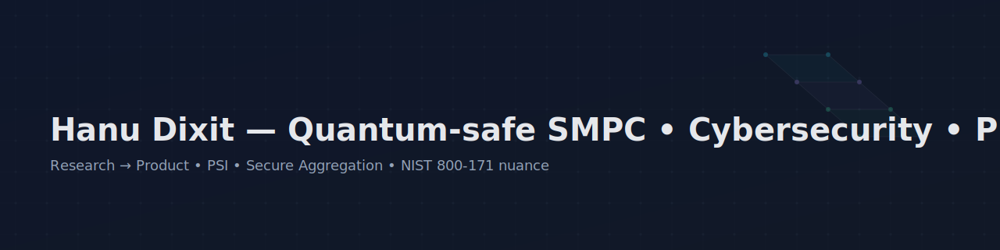

  

# Hanu Dixit — Quantum-safe SMPC • Data Science • Healthcare

**I bridge cutting-edge research in quantum-safe secure multi-party computation (SMPC) into production-ready data science and healthcare solutions, ensuring compliance and real-world impact.**

### Focus Areas

*   **Research → Product:** Translating advanced cryptographic research and data science models into tangible, user-centric applications and products. My background as a Product Manager and Business Analyst informs a pragmatic, outcome-driven approach.
*   **Security & Compliance:** Architecting systems with a deep understanding of data security, privacy, and regulatory compliance, including NIST 800-171 controls and healthcare data regulations.
*   **Healthcare Data:** Specializing in the secure and ethical application of data science techniques within healthcare, focusing on patient privacy and actionable insights.

### My Work

  

#### Featured Work

*   **SENTINEL-QSMPC:** A proof-of-concept framework for quantum-safe secure multi-party computation in healthcare settings, aiming to enable collaborative data analytics without revealing underlying patient data.
*   **sentinel-demo:** A client-side demonstration of Private Set Intersection (PSI) using hashed patient IDs, showcasing how secure computation concepts can be quickly prototyped and validated. This micro-demo highlights the "research-to-product" pathway with a focus on healthcare data privacy.

### Roadmap & Collaborations

I am actively building out features and exploring new applications for secure computation and data science in healthcare. Check out my public roadmap and issues to see what's next and how you can contribute or collaborate. Your insights are welcome!

**Contact:** hanudixit.2017[at]gmail[dot]com
**LinkedIn:** [Hanu Dixit](https://www.linkedin.com/in/hanukdixit07)
